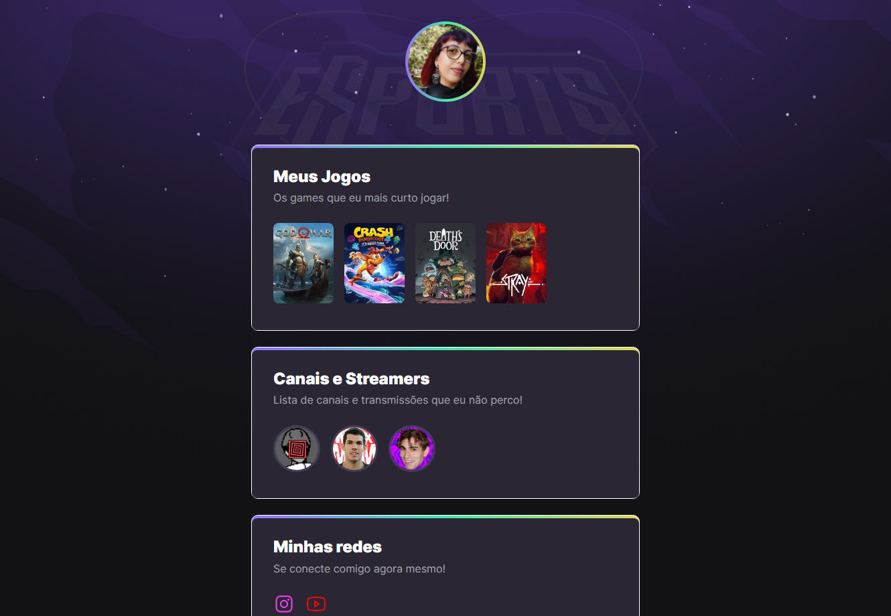

# NLW eSports 

 > Trilha Explorer

Projeto construído no Evento 
"Next Level Week" da Rocketseat.

🔗 [Clique aqui para acessar](http://TartarottiPaula.github.io/NLW-esports-explorer)

## ⌨️ Tecnologias 

- HTML  
- CSS
- GIT e GitHub

## O que aprendi:
    - Criação de listas com links para outras páginas;
    - Animações para demonstrar parte ativa, como zoom in e out conforme passa o mouse em cima, além do surgimento das informações assim que acessar o link;
    - Inserção do background com imagem e complemento da parte inferior;
    - Cores em gradiente das bordas;

##  🖤 Contato
- paula.tcelso@gmail.com